[TOC]

# 1 etcd 综述
## 1.1 etcd 是什么
官网定义： 
1. Highly-avaliable key value store for shared configuration and service discovery
2. A distributed, reliable key-value store for the most critical data of a distributed system
* [性能测试](https://github.com/etcd-io/etcd/blob/master/Documentation/op-guide/performance.md#benchmarks)

### 1.1.1 etcd v2 发布时间轴


### 1.1.2 etcd v3 发布时间轴


## 1.2 Adopters
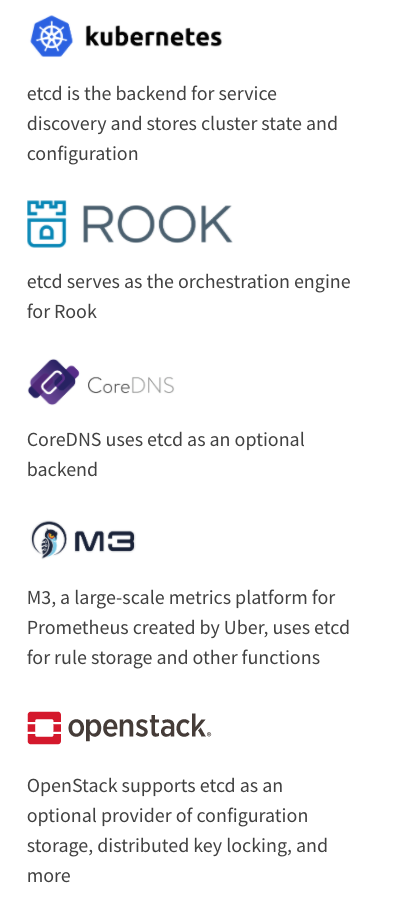

## 1.3 etcd VS zookeeper
### 1.3.1 主要解决的问题：
* 元数据存储
* 分布式协同

### 1.3.2 etcd 的优点
* 支持线性读（支持读到最新数据）
* **流式 Watcher**，历史事件**通常**不会丢失，复用网络连接；zookeeper 是单次 watch，服务端接受到 watch 请求之前的事件丢失，每个 watch 请求使用新的连接
* 通讯协议：
    * zk 基于自定义的 Jute 协议， 其他语言的支持困难
	* etcd 基于 gRPC，其他语言开箱即用
* 分布式协同原语维护方（分布式锁，选举，租约等）
    * etcd 是 官方维护
	* zk 通常使用 Curator。Curator是 Netflix 公司开源的一个Zookeeper客户端，Curator框架在zookeeper 原生 API 接口上进行了包装，解决了很多 ZooKeeper 客户端非常底层的细节开发

## 1.4 基本功能
https://etcd.io/docs/v3.4.0/demo/
* get/put
* compact
* txn
* watch
* lease
* status

```shell
[DEV (v.v) sa_cluster@test1 ~]$ /sensorsdata/main/program/armada/etcd/bin/etcdctl endpoint status -w="table"  --endpoints=test1.sa:2379
+---------------+------------------+---------+---------+-----------+------------+-----------+------------+--------------------+--------+
|   ENDPOINT    |        ID        | VERSION | DB SIZE | IS LEADER | IS LEARNER | RAFT TERM | RAFT INDEX | RAFT APPLIED INDEX | ERRORS |
+---------------+------------------+---------+---------+-----------+------------+-----------+------------+--------------------+--------+
| test1.sa:2379 | 685785ec03d61bfd |  3.4.13 |   20 kB |      true |      false |         2 |          8 |                  8 |        |
+---------------+------------------+---------+---------+-----------+------------+-----------+------------+--------------------+--------+
```

## 1.5 版本控制 (MVCC)
* 写操作都会创建新的版本
* 读操作会从有限的多个版本中挑选一个最合适的（要么是最新版本，要么是指定版本)
* 无需关心读写之间的冲突

### 1.5.1 版本描述
从 etcd 中描述 key value 可以看到：
```go
type KeyValue struct {
	// key is the key in bytes. An empty key is not allowed.
	Key []byte `protobuf:"bytes,1,opt,name=key,proto3" json:"key,omitempty"`
	// 该 key 最后一次时的 revision, （分布式锁就用了它）
	CreateRevision int64 `protobuf:"varint,2,opt,name=create_revision,json=createRevision,proto3" json:"create_revision,omitempty"`
	// 该 key 最后一次修改时的 revision
	ModRevision int64 `protobuf:"varint,3,opt,name=mod_revision,json=modRevision,proto3" json:"mod_revision,omitempty"`
	// 1. key 当前的版本
	// 2. 任何对 key 的修改都会增加该值
	// 3. 删除 key 会使该值归零
	Version int64 `protobuf:"varint,4,opt,name=version,proto3" json:"version,omitempty"`
	// value is the value held by the key, in bytes.
	Value []byte `protobuf:"bytes,5,opt,name=value,proto3" json:"value,omitempty"`
	// 赋予的租约id，如果是 0 代表没有租约
	Lease int64 `protobuf:"varint,6,opt,name=lease,proto3" json:"lease,omitempty"`
}
```

### 1.5.2 逻辑时钟 (revision)
* int64 全局递增
* 可以视为全局的逻辑时钟，任何键空间发生变化，revision 都会增加；指定 revision 操作时，理解为时钟回退到那个时刻
* 用事务封装的操作，revision 在后台只会更改一次
* revision值大的键值对一定是在revision值小键值对之后修改的

## 1.6 etcd API
* https://github.com/etcd-io/etcd/blob/release-3.4/etcdserver/etcdserverpb/rpc.proto
* https://godoc.org/github.com/coreos/etcd/clientv3

### 1.6.1 核心 API
* **KV** （range, 线性读/串行读）
```go
service KV {
  // 从键值存储中获取范围内的key.
  rpc Range(RangeRequest) returns (RangeResponse) {}
​
  // 放置给定key到键值存储.
  rpc Put(PutRequest) returns (PutResponse) {}
​
  // 从键值存储中删除给定范围。
  rpc DeleteRange(DeleteRangeRequest) returns (DeleteRangeResponse) {}
​
  // 在单个事务中处理多个请求。
  // 不容许在一个txn中多次修改同一个key.
  rpc Txn(TxnRequest) returns (TxnResponse) {}
​
  // 压缩在etcd键值存储中的事件历史。
  // 键值存储应该定期压缩，否则事件历史会无限制的持续增长.
  rpc Compact(CompactionRequest) returns (CompactionResponse) {}
}
```

* **Watch** (复用连接、可 watch 范围/历史)
```go
service Watch {
  // Watch watches for events happening or that have happened. Both input and output
  // are streams; the input stream is for creating and canceling watchers and the output
  // stream sends events. One watch RPC can watch on multiple key ranges, streaming events
  // for several watches at once. The entire event history can be watched starting from the
  // last compaction revision.
  // 1. Watch 检测将要发生或者已经发生的事件。
  // 2. 输入流用于创建和取消观察，输出流发送事件。
  // 3. 一个 RPC 可以在多个 key range 上 watch。
  // 4. watch 可以在最后压缩修订版本开始观察。
  rpc Watch(stream WatchRequest) returns (stream WatchResponse) {}}
}
```

* **Lease** (有最小TTL)
```go
service Lease {
  // LeaseGrant 创建一个租约，当服务器在给定 time to live 时间内没有接收到 keepAlive 时租约过期。
  // 如果租约过期则所有附加在租约上的key将过期并被删除。
  // 每个过期的key在事件历史中生成一个删除事件。
  rpc LeaseGrant(LeaseGrantRequest) returns (LeaseGrantResponse) {}

  // LeaseRevoke 撤销一个租约。
  // 所有附加到租约的key将过期并被删除。
  rpc LeaseRevoke(LeaseRevokeRequest) returns (LeaseRevokeResponse) {}

  // 续约
  rpc LeaseKeepAlive(stream LeaseKeepAliveRequest) returns (stream LeaseKeepAliveResponse) {}

  // LeaseTimeToLive 获取租约信息。
  rpc LeaseTimeToLive(LeaseTimeToLiveRequest) returns (LeaseTimeToLiveResponse) {}
}
```

clientV3：
* KeepAlive 自动无限续租
    * grpc stream，创建协程无限续租，间隔500ms
    * 如果 stream 失效， 500ms重试
* KeepAliveOnce 续租一次

**Cluster**
集群管理相关 add/remove/update member/learner

**Maintenance**
维护相关操作(报警/后端碎片整理)

**Auth**
用户鉴权管理相关

### 1.5.2 并发 API
[并发 API 官方文档](https://github.com/etcd-io/etcd/blob/master/Documentation/dev-guide/api_concurrency_reference_v3.md)

* **Lock 分布式锁**
```go
type LockServer interface {
	// Lock acquires a distributed shared lock on a given named lock.
	// On success, it will return a unique key that exists so long as the
	// lock is held by the caller. This key can be used in conjunction with
	// transactions to safely ensure updates to etcd only occur while holding
	// lock ownership. The lock is held until Unlock is called on the key or the
	// lease associate with the owner expires.
	Lock(context.Context, *LockRequest) (*LockResponse, error)
	// Unlock takes a key returned by Lock and releases the hold on lock. The
	// next Lock caller waiting for the lock will then be woken up and given
	// ownership of the lock.
	Unlock(context.Context, *UnlockRequest) (*UnlockResponse, error)
}
```
etcdserver/api/v3lock/lock.go 通过 clientV3(concurrency) 实现

* 在 key prefix 下创建一个key，并不断续租
* key prefix下的所有 key 有不同的revision，revision 最小的那个 key 将获得锁
* revision 不是最小的 key 的持有者将阻塞，直到revision比它小的所有key都被删除时，它才获得锁

核心逻辑：
* lock
```go
func (m *Mutex) Lock(ctx context.Context) error {
	s := m.s
	client := m.s.Client()
    //尝试抢锁客户端要创建的key的名字
    m.myKey = fmt.Sprintf("%s%x", m.pfx, s.Lease())
    // 事务，key不存在则创建，存在则get（重复使用已经持有的锁key）,并且都获取 prefix key的信息
	cmp := v3.Compare(v3.CreateRevision(m.myKey), "=", 0)
	put := v3.OpPut(m.myKey, "", v3.WithLease(s.Lease()))
	get := v3.OpGet(m.myKey)
    getOwner := v3.OpGet(m.pfx, v3.WithFirstCreate()...)
    // 启动事务 
    resp, err := client.Txn(ctx).If(cmp).Then(put, getOwner).Else(get, getOwner).Commit()
    // 拿到当前的 revision，用于比较自己是否是最小的, 如果是最小的则抢锁成功
	m.myRev = resp.Header.Revision
	// if no key on prefix / the minimum rev is key, already hold the lock
	ownerKey := resp.Responses[1].GetResponseRange().Kvs
	if len(ownerKey) == 0 || ownerKey[0].CreateRevision == m.myRev {
		m.hdr = resp.Header
		return nil
	}
    // 如果没抢到就等待比自己小的key都删除
	hdr, werr := waitDeletes(ctx, client, m.pfx, m.myRev-1)
	return werr
}
```
问题： 如果 keyprefix下的 key 被外部删除了，所有都认为自己抢锁成功
* unlock: 把 myKey 删掉就行了


* **Election 选举**
```go
type ElectionServer interface {
	// Campaign waits to acquire leadership in an election, returning a LeaderKey
	// representing the leadership if successful. The LeaderKey can then be used
	// to issue new values on the election, transactionally guard API requests on
	// leadership still being held, and resign from the election.
	Campaign(context.Context, *CampaignRequest) (*CampaignResponse, error)
	// Proclaim updates the leader's posted value with a new value.
	Proclaim(context.Context, *ProclaimRequest) (*ProclaimResponse, error)
	// Leader returns the current election proclamation, if any.
	Leader(context.Context, *LeaderRequest) (*LeaderResponse, error)
	// Observe streams election proclamations in-order as made by the election's
	// elected leaders.
	Observe(*LeaderRequest, Election_ObserveServer) error
	// Resign releases election leadership so other campaigners may acquire
	// leadership on the election.
	Resign(context.Context, *ResignRequest) (*ResignResponse, error)
}
```
etcdserver/api/v3election/election.go 通过 clientV3(concurrency) 

选举

1. etcd的选举也是在相应的prefix path下面创建key，该key绑定了lease 并根据 lease id进行命名
2. key创建后就有revision号，这样使得在prefix path下的key也都是按revision有序
3. 每个节点watch比自己createRevision小并且最大的节点，等到所有比自己createRevision小的节点都被删除后，自己才成为leader
```go
func (e *Election) Campaign(ctx context.Context, val string) error {
	s := e.session
	client := e.session.Client()
	// 事务，如果if判断为true，那么put这个key，否则get这个key；最终都能获取到这个key的内容。
	k := fmt.Sprintf("%s%x", e.keyPrefix, s.Lease())
	txn := client.Txn(ctx).If(v3.Compare(v3.CreateRevision(k), "=", 0))
	txn = txn.Then(v3.OpPut(k, val, v3.WithLease(s.Lease())))
	txn = txn.Else(v3.OpGet(k))
	resp, err := txn.Commit()

	e.leaderKey, e.leaderRev, e.leaderSession = k, resp.Header.Revision, s
	// key 已经存在，执行的事务的 else 分支
	if !resp.Succeeded {
		kv := resp.Responses[0].GetResponseRange().Kvs[0]
		e.leaderRev = kv.CreateRevision
		if string(kv.Value) != val {
			// 判定val不相同，在不更换leader的情况下，更新val
			if err = e.Proclaim(ctx, val); err != nil {
				e.Resign(ctx)
				return err
			}
		}
	}

    // 一直阻塞知道当前的revision最小,从而当选 leader
	_, err = waitDeletes(ctx, client, e.keyPrefix, e.leaderRev-1)
	return nil
}
```

重新选举
```go
func (e *Election) Resign(ctx context.Context) (err error) {
	if e.leaderSession == nil {
		return nil
	}
	client := e.session.Client()
	// 如果当前leaderkey的revision没有变化，就把节点删除，
	cmp := v3.Compare(v3.CreateRevision(e.leaderKey), "=", e.leaderRev)
	resp, err := client.Txn(ctx).If(cmp).Then(v3.OpDelete(e.leaderKey)).Commit()
	e.leaderKey = ""
	e.leaderSession = nil
	return err
}
```

## 1.7 etcd 主要应用场景

* 服务发现 (租约，心跳保持 )
* 消息发布与订阅 (Watch)
* 负载均衡 (利用服务发现维护可用服务列表，请求过来后轮询转发)
* 分布式通知与协调 (Watch)
* 分布式锁 (最小的 create_revision)
* 选举（分布式锁）

## 1.8 高可用
半数以上投票可选主（单节点特殊选主流程，直接为主）
| 节点个数 | 高可用情况                                                                    |
| -------- | ---------------------------------------------------------------------------------- |
| 1        | 没有高可用，可以选主（走的特殊 raft 逻辑）                                             |
| 2        | 没有高可用，能选主，如果挂掉一台，不能选主，活着的节点可以读（非一致性读），不能写 |
| 3        | 允许挂1个                                                                      |
| 4        | 允许挂1个                                                                      |
| 5        | 允许挂2个                                                                      |
| 6        | 允许挂2个                                                                      ||


# 2 总体架构
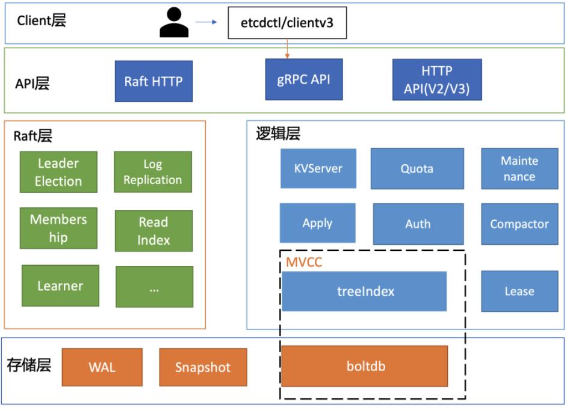
* Client 层：API 客户端库， 支持负载均衡、节点间故障自动转移
* API 网络层：
    * client 访问 server，使用 grpc（通过 grpc-gateway 也支持 HTTP/1.x）
	* server 节点之间的通信协议，使用的 HTTP 协议。
* Raft 层：数据一致性的保证，我觉得是 etcd 最重要的模块
* 功能层：etcd 核心功能实现层
* 存储层：存储层包含预写日志 (WAL) 模块、快照 (Snapshot) 模块、boltdb 模块。

# 3 模块原理拆解
## 3.1 共识层（etcd-raft/node）
### 3.1.1 状态机复制
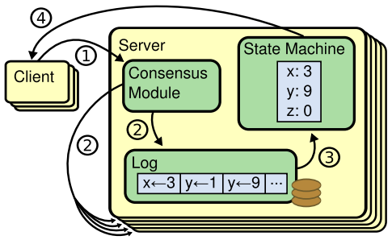

* 解决问题：分布式高可用，多副本。
* 基本假设：如果状态机拥有相同的初始状态，接收到相同的命令，处理这些命令的顺序也相同，那么最终状态就会相同。
* Leader 拥有绝对权利

### 3.1.2 选举流程（状态切换）
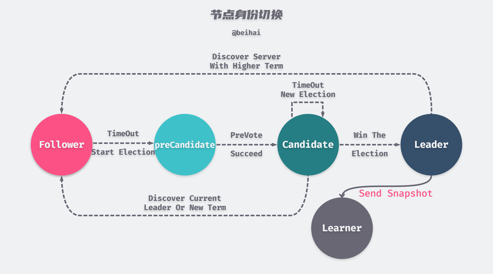
```go
// 两个计时器的超时时间
heartbeatTimeout int
electionTimeout  int
```

注意点
* Follower 拒绝投票给日志没有自己新的 candidate，保证能够成为 Leader 的 candidate 一定包含最新的日志
* Learner： 新加入集群节点，不参与抢主，防止长时间同步日志， Leader直接向其发送快照
* PreVote：防止网络分区，不够半数以上的分区无限发起选举，因此必须能够和半数以上的节点连接成功的节点才能成为 candidate

**时钟计时器**：raft内部计时器，推进时间向前，逻辑概念，不是真实时钟

* becomeFollower()，主要工作是设置 raft 各类变量
```go
func (r *raft) becomeFollower(term uint64, lead uint64) {
	// 处理消息的函数指针
	r.step = stepFollower
	r.reset(term)
	// 推进时钟计时器方法为 竞选计时器
	r.tick = r.tickElection
	r.lead = lead
	r.state = StateFollower
	r.logger.Infof("%x became follower at term %d", r.id, r.Term)
}
```
成为 follower 后，会被上层应用定期触发 tick，推进检测时钟是否超时
```go
func (r *raft) tickElection() {
	r.electionElapsed++
	// 超时
	if r.promotable() && r.pastElectionTimeout() {
		r.electionElapsed = 0
		// 触发选举(MsgHup)
		r.Step(pb.Message{From: r.id, Type: pb.MsgHup})
	}
}
```

* becomeCandidate()
当 follower 连接数大于一半时调用 becomeCandidate() 成为候选

* becomeLeader()
当 candidate 投票超过半数，则调用 becomeLeader 

### 3.1.3 日志
Entry: 每一个操作项, raft 的核心能力就是为应用层提供序列相同的 Entry
```go
type Entry struct {
	// 任期
	Term             uint64
	// 每一个Entry都有一个的Index，代表当前Entry在log entry序列中的位置，每个index上最终只有1个达成共识的Entry。
	Index            uint64
	// 表明当前Entry的类型，EntryNormal/EntryConfChange/EntryConfChangeV2
	Type             EntryType
	// 序列化的数据, 如果是 entry normal 为键值对
	Data             []byte
}

const (
	EntryNormal       EntryType = 0
	EntryConfChange   EntryType = 1
	EntryConfChangeV2 EntryType = 2
)
```

RaftLog: 本地Log，管理节点 Entry
```go
type raftLog struct {
	// storage contains all stable entries since the last snapshot.
	//每次都从磁盘文件读取这些数据，效率必然是不高的，所以etcd/raft内定义了MemoryStorage，它实现了Storage接口，并且提供了函数来维护最新快照后的Entry
	storage Storage

	// unstable contains all unstable entries and snapshot.
	// they will be saved into storage.
	// 由于 Entry 的存储是由应用层负责的，所以raft需要暂时存储还未存到Storage中的Entry或者Snapshot，在创建Ready时，Entry和Snapshot会被封装到Ready，由应用层写入到storage
	unstable unstable

	// committed is the highest log position that is known to be in
	// stable storage on a quorum of nodes.
	// 最后一个在raft集群多数节点之间达成一致的Entry Index。
	committed uint64
	// applied is the highest log position that the application has
	// been instructed to apply to its state machine.
	// Invariant: applied <= committed
	// 当前节点被应用层应用到状态机的最后一个Entry Index。applied和committed之间的Entry就是等待被应用层应用到状态机的Entry。
	applied uint64

	logger Logger

	// maxNextEntsSize is the maximum number aggregate byte size of the messages
	// returned from calls to nextEnts.
	maxNextEntsSize uint64
}
```
raftLog 物理视图


### 3.1.4 消息处理
节点间通讯的结构体
```go
type Message struct {
	Type             MessageType `protobuf:"varint,1,opt,name=type,enum=raftpb.MessageType" json:"type"`
	To               uint64      `protobuf:"varint,2,opt,name=to" json:"to"`
	From             uint64      `protobuf:"varint,3,opt,name=from" json:"from"`
	Term             uint64      `protobuf:"varint,4,opt,name=term" json:"term"`
	// 创建Message时，发送节点本地所保存的log entry序列中最大的Term，在选举的时候会使用。
	LogTerm          uint64      `protobuf:"varint,5,opt,name=logTerm" json:"logTerm"`
	// 不同的消息类型，Index的含义不同。Term和Index与Entry中的Term和Index不一定会相同，因为某个follower可能比较慢，leader向follower发送已经committed的Entry。
	Index            uint64      `protobuf:"varint,6,opt,name=index" json:"index"`
	// 发送给 follower 待处理的 entries
	Entries          []Entry     `protobuf:"bytes,7,rep,name=entries" json:"entries"`
	// 消息发送节点提交的位置
	Commit           uint64      `protobuf:"varint,8,opt,name=commit" json:"commit"`
	// leader 传递给follower 的 snapshot
	Snapshot         Snapshot    `protobuf:"bytes,9,opt,name=snapshot" json:"snapshot"`
	Reject           bool        `protobuf:"varint,10,opt,name=reject" json:"reject"`
	RejectHint       uint64      `protobuf:"varint,11,opt,name=rejectHint" json:"rejectHint"`
	Context          []byte      `protobuf:"bytes,12,opt,name=context" json:"context,omitempty"`
	XXX_unrecognized []byte      `json:"-"`
}

const (
	// 选举计时器超时创建的消息，触发选举
	MsgHup            MessageType = 0
	MsgBeat           MessageType = 1
	MsgProp           MessageType = 2
	MsgApp            MessageType = 3
	MsgAppResp        MessageType = 4
	MsgVote           MessageType = 5
	MsgVoteResp       MessageType = 6
	MsgSnap           MessageType = 7
	MsgHeartbeat      MessageType = 8
	MsgHeartbeatResp  MessageType = 9
	MsgUnreachable    MessageType = 10
	MsgSnapStatus     MessageType = 11
	MsgCheckQuorum    MessageType = 12
	MsgTransferLeader MessageType = 13
	MsgTimeoutNow     MessageType = 14
	MsgReadIndex      MessageType = 15
	MsgReadIndexResp  MessageType = 16
	MsgPreVote        MessageType = 17
	MsgPreVoteResp    MessageType = 18
)
```
* MsgHup
Follower 的选举计时器超时会创建 MsgHup 消息并调用 raft.Step()方法处理，该方法是各类消息处理的入口
```go
func (r *raft) Step(m pb.Message) error {
	switch m.Type {
	case pb.MsgHup:
		// 非leader 才会处理
		if r.state != StateLeader {
			// 调用 campaign 进行角色切换
			if r.preVote {
				r.campaign(campaignPreElection)
			} else {
				r.campaign(campaignElection)
			}
		} else {
			r.logger.Debugf("%x ignoring MsgHup because already leader", r.id)
		}
    // 其他先不关心
	return nil
}
```
campaign 除了完成状态切换，也会向其他节点发起同类消息(只**保存到 raft.msg 里，不真的发送**)
```go
func (r *raft) campaign(t CampaignType) {
	// 方法最后会发送一条消息
	var term uint64
	var voteMsg pb.MessageType
	if t == campaignPreElection {
         ...
    // 切换成候选
	} else {
		r.becomeCandidate()
		// 向其他节点发起投票消息
		voteMsg = pb.MsgVote
		term = r.Term
	}
	// 统计节点收到的选票，这里考虑的是单节点场景，投票给自己之后就能赢得选举
	if _, _, res := r.poll(r.id, voteRespMsgType(voteMsg), true); res == quorum.VoteWon {
		// We won the election after voting for ourselves (which must mean that
		// this is a single-node cluster). Advance to the next state.
		if t == campaignPreElection {
			r.campaign(campaignElection)
        // 票数足够，成为 leader
		} else {
			r.becomeLeader()
		}
		return
	}
	
	for _, id := range ids {
		if id == r.id {
			continue
		}
		r.logger.Infof("%x [logterm: %d, index: %d] sent %s request to %x at term %d",
			r.id, r.raftLog.lastTerm(), r.raftLog.lastIndex(), voteMsg, id, r.Term)

		var ctx []byte
		if t == campaignTransfer {
			ctx = []byte(t)
		}
		// 向其他节点发送消息，主要只是追加到 raft.msg 里, 待上层应用发送
		r.send(pb.Message{Term: term, To: id, Type: voteMsg, Index: r.raftLog.lastIndex(), LogTerm: r.raftLog.lastTerm(), Context: ctx})
	}
}
```

### 3.1.5 raft 总结
raft 本身没有实现网络层，持久化，这些都交给了上层应用来做
* 消息发送只是缓存在  ```msgs []pb.Message```, 上层来发送
* Entry 持久化缓存在 raftLog 里， 上层应用来持久化本地以及 把 unstable 写入到 Storage

### 3.1.6 对raft的一层抽象 Node
* 衔接应用层和 Raft 模块的消息传输，将应用层的消息传递给 Raft 模块，并将 raft 模块处理后的结果反馈给应用层

```go
type node struct {
	propc      chan msgWithResult
	recvc      chan pb.Message
	confc      chan pb.ConfChangeV2
	confstatec chan pb.ConfState
	readyc     chan Ready
	advancec   chan struct{}
	tickc      chan struct{}
	done       chan struct{}
	stop       chan struct{}
	status     chan chan Status

	rn *RawNode
}
```
node 与上层应用以及下层 raft 的通信的主流程：
```go
func (n *node) run() {
	for {
		// 上层模块还没有处理完，因此不需要往 ready 通道写入数据
		if advancec != nil {
			readyc = nil

		} else if n.rn.HasReady() {
			// 构造 ready
			rd = n.rn.readyWithoutAccept()
			readyc = n.readyc
		}

		select {
		// 读取 propc 通道，获取 MsgPropc 消息，交给 raft.step() 处理
		case pm := <-propc:
			m := pm.m
			m.From = r.id
			err := r.Step(m)
		   ...
        // 逻辑时钟推进一次，调用 raft.tick() 进行时钟推进
		case <-n.tickc:
			n.rn.Tick()
        // 将创建好的 Ready 对象写入 readyc 通道，等待上层使用
		case readyc <- rd:
			n.rn.acceptReady(rd)
			advancec = n.advancec
        // 上层模块处理完 Ready 实例的信号
		case <-advancec:
			n.rn.Advance(rd)
			rd = Ready{}
			advancec = nil
			return
		}
	}
}
```

raft 使用 Ready 对外传递数据，上层引用处理完一个后调用 Advance(), 通知 raft 产生下一个 ready
```go
// 主要字段如下:
type Ready struct {
	// Entries保存的是从unstable读取的Entry，它们即将被应用层写入storage
	Entries []pb.Entry
	// Snapshot specifies the snapshot to be saved to stable storage.
	Snapshot pb.Snapshot
	// 已经被 Committed，还没有applied，应用层会把他们应用到状态机。
	CommittedEntries []pb.Entry
	// 需要处理的消息
	Messages []pb.Message
}
```

### 3.1.7 工作流
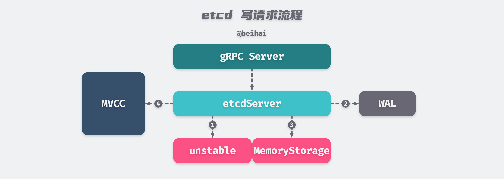
1. 客户端发送写请求，请求封装成 Entry 日志给 Raft 处理，Raft 将 Entry 保存到 unstable
2. Raft 模块将该 Entry 日志封装到 Ready 实例中，返回给上层模块进行持久化
3. 上层应用收到待持久化的 Entry 日志，其写入 WAL 文件，然后向集群中的其它节点广播这一条数据
4. 上层应用通知 raft 模块将该 Entry 日志从 unstable 『移动』到 MemoryStorage；
5. Entry 日志被复制到集群半数以上的节点时，该 Entry 日志会被 Leader 节点确认为己提交，Leader 会回复客户端写请求操作成功，并将 Entry 日志再次封装进 Ready 实例返回给上层模块；
6. 上层模块将该 Ready 实例中携带的待应用 Entry 日志应用到状态机中。
7. 上层应用通知 raft 模块将该 Entry 日志应用到 storage 

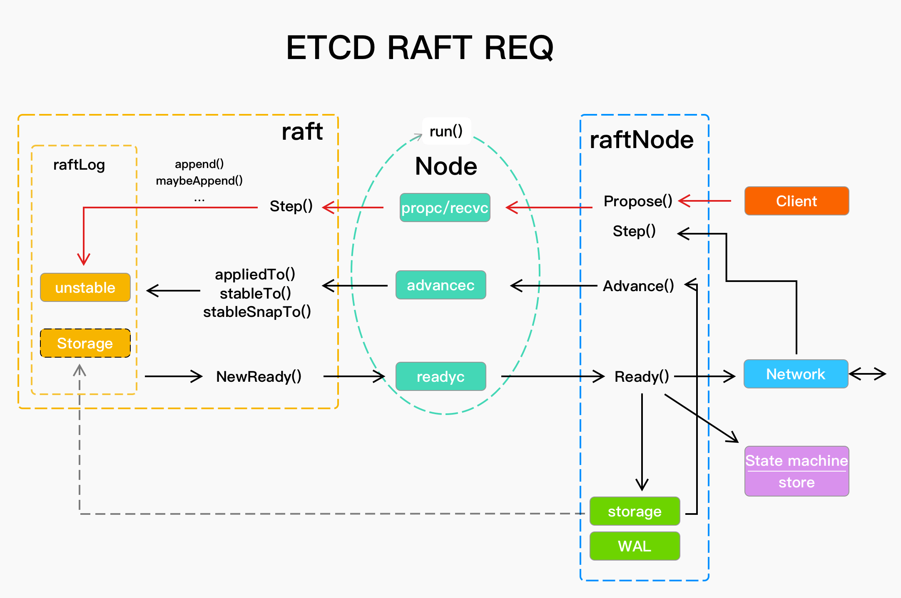

### 3.1.8 线性读 ReadIndex
* MsgReadIndex 消息，没有过 raft 协议
1. 首先向 leader 获取最新的 committed index
2. 等待，知道 applied index >= committed index
3. 从状态机读数据

## 3.2 网络层 (raft-http)
### 3.2.1 etcd 集群之间网络传输的主要场景
* leader 向 follower 传递心跳包，follower 向 leader回复消息
* leader 向 follower 发送追加日志
* leader 向 follower 发送 snapshot 数据
* candidate 发起选举
* follower 收到写操作转发给 leader

### 3.2.2 etcd 网络拓扑

* 每一个节点都会创建到其他各个节点之间的长链接。
* 每个节点会向其他节点广播自己监听的端口，该端口只接受来自其他节点请求

## 3.2.3 etcd 数据通道
* 所有的消息类型传输都通过 PB 封装。
* 数据大小不尽相同。 如 SNAPSHOT 数据，甚至超过1GB, 心跳消息只有几十个字节。
* 2 种类型消息传输通道：Stream、Pipeline，使用HTTP协议传输数据。

```go
func (p *pipeline) post(data []byte) (err error) {
    u := p.picker.pick()
    // pb 格式序列化
	req := createPostRequest(u, RaftPrefix, bytes.NewBuffer(data), "application/protobuf", p.tr.URLs, p.tr.ID, p.tr.ClusterID)
 
    ... 
    // 发送 post 请求
	resp, err := p.tr.pipelineRt.RoundTrip(req)

	return nil
}
```

集群启动开始，就创建了这两种传输通道：
* Stream：点到点之间维护HTTP长链接，主要用于传输数据量较小的消息，例如追加日志，心跳等；
* Pipeline：点到点之间不维护HTTP长链接，短链接传输数据，用完即关闭。用于传输数据量大的消息，例如snapshot数据。
* 都是基于 go http 实现的

### 3.2.4 Stream类型通道
1. Stream类型通道处理数据量少的消息，例如心跳，日志追加消息。点到点之间只维护1个HTTP长链接，交替向链接中写入数据，读取数据。

2. 每一个Stream类型通道关联2个Goroutines, 其中一个用于建立HTTP链接，并从链接上读取数据, decode成message, 通过Channel传给Raft模块中，另外一个通过Channel 从Raft模块中收取消息，然后写入通道。


### 3.2.5 Pipeline类型通道
1. Pipeline类型通道处理数量大消息，例如SNAPSHOT消息。这种类型消息需要和心跳等消息分开处理，否则会阻塞心跳。
2. Pipeline类型通道也可以传输小数据量的消息，当且仅当Stream类型链接不可用时。

## 3.3 wal
etcdserver 将 put 提案消息广播给集群各个节点，同时需要把集群 Leader 任期号、投票信息、已提交索引、提案内容持久化到一个 WAL（Write Ahead Log）日志文件中，用于保证集群的一致性、可恢复性

## 3.3.1 日志结构


```go
type Record struct {
    // 类型
    Type             int64  `protobuf:"varint,1,opt,name=type" json:"type"`
    // 校验码
    Crc              uint32 `protobuf:"varint,2,opt,name=crc" json:"crc"`
    // 日志数据，根据类型不同，内容也不同
    Data             []byte `protobuf:"bytes,3,opt,name=data" json:"data,omitempty"`
}
```
类型
```go
const (
    // 元数据类型。每个wal文件的开头都记录了一条元数据, 节点 ID、集群 ID 信息
    metadataType int64 = iota + 1
    // entry 记录，客户端发送给服务端的数据
    entryType
    // 集群状态， hardstate, 批量写入entrytype类型的日志之前，都会先记录一条 statetype日志
    stateType
    // 用于校验
    crcType
    // 快照的数据相关信息, 快照记录包含快照的任期号、日志索引信息，用于检查快照文件的准确性，只记录索引，不记录数据
    /*
    type Snapshot struct {
	Index            uint64 `protobuf:"varint,1,opt,name=index" json:"index"`
	Term             uint64 `protobuf:"varint,2,opt,name=term" json:"term"`
     }
	*/
    snapshotType
)
```
### 3.3.2 文件管理


* 要么是只读（节点恢复）、要么只能追加写
* 格式为"序号--raft日志索引.wal
* 日志大小 SegmentSizeBytes，默认64M，超限后会切割，提前创建以.tmp结尾的临时文件备用
* 调用 fsync 持久化，一半持久化之后被认为已提交

### 3.3.3 snap


* 做过快照之后的wal 可以删除（日志回放）

## 3.4 存储层 (MVCC)
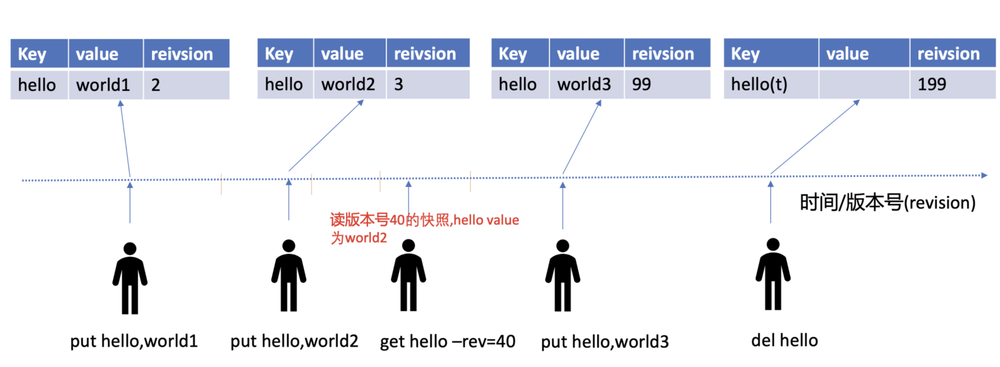
```shell
# 更新key hello为world1
$ etcdctl put hello world1
OK
# 通过指定输出模式为json,查看key hello更新后的详细信息
$ etcdctl get hello -w=json
{
    "kvs":[
        {
            "key":"aGVsbG8=",
            "create_revision":2,
            "mod_revision":2,
            "version":1,
            "value":"d29ybGQx"
        }
    ],
    "count":1
}
# 再次修改key hello为world2
$ etcdctl put hello world2
OK
# 确认修改成功,最新值为wolrd2
$ etcdctl get hello
hello
world2
# 指定查询版本号,获得了hello上一次修改的值
$ etcdctl get hello --rev=2
hello
world1
# 删除key hello
$ etcdctl del  hello
1
# 删除后指定查询版本号3,获得了hello删除前的值
$ etcdctl get hello --rev=3
hello
world2
```

### 3.4.1 整体架构

* ReadTx 定义了抽象的读事务接口
* BatchTx 在 ReadTx 之上定义了抽象的写事务接口
* Buffer 是数据缓存区。

boltdb 存储格式
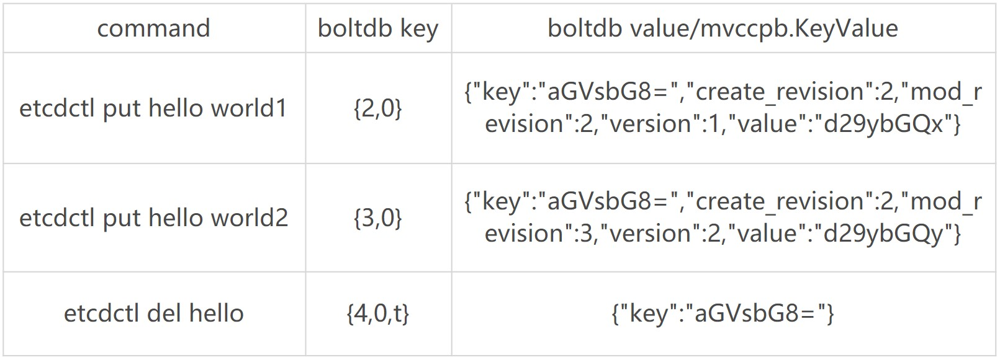


### 3.4.2 TreeIndex
treeIndex 模块基于内存版的 B-tree 实现了 key 索引管理，它保存了用户 key 与版本号（revision）的映射关系等信息。

```go
// 实现的接口
type index interface {
	Get(key []byte, atRev int64) (rev, created revision, ver int64, err error)
	Range(key, end []byte, atRev int64) ([][]byte, []revision)
	Revisions(key, end []byte, atRev int64) []revision
	Put(key []byte, rev revision)
	Tombstone(key []byte, rev revision) error
	RangeSince(key, end []byte, rev int64) []revision
	Compact(rev int64) map[revision]struct{}
	Keep(rev int64) map[revision]struct{}
	Equal(b index) bool

	Insert(ki *keyIndex)
	KeyIndex(ki *keyIndex) *keyIndex
}

type treeIndex struct {
	sync.RWMutex
	tree *btree.BTree
	lg   *zap.Logger
}
```

b-tree 结构
* 索引：用户原始 key 值
* value： KeyIndex

**为什么使用 b-tree？而不是 hashmap 或者平衡二叉树**
1. etcd 支持范围查询，哈希表不合适
2. 为了减少查询次数使用 b tree，而不是平衡二叉树
3. etcd 使用 b 树的度数是 32，即每个节点最多有 64 个key
```go
func newTreeIndex(lg *zap.Logger) index {
	return &treeIndex{
		tree: btree.New(32),
		lg:   lg,
	}
}
```


#### KeyIndex
```go
type keyIndex struct { 
    key []byte //用户的key名称
    modified revision //最后一次修改key时的etcd revision
    generations []generation //generation保存了一个key若干代版本号信息，每代中包含对key的多次修改的版本号列表
}


type generation struct {
   ver     int64    //表示此key的修改次数
   created revision //表示generation结构创建时的版本号
   revs    []revision //每次修改key时的revision追加到此数组
}
```

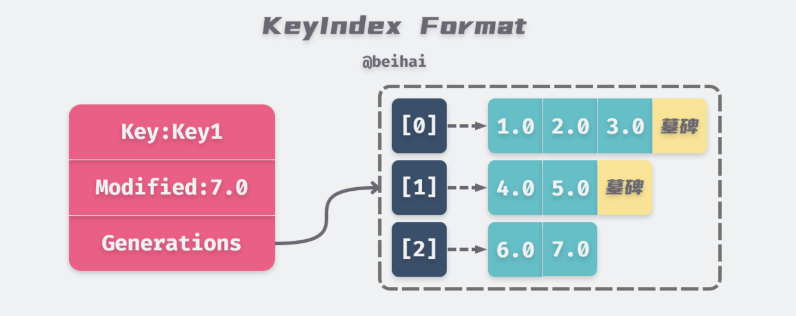

### 3.4.3 更新 key
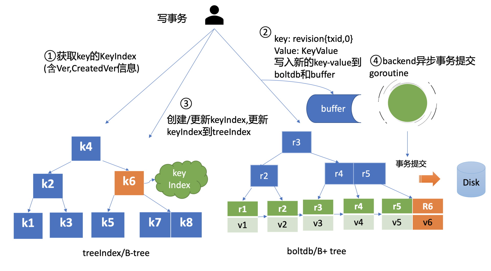
1. 从 treeindex 找到 keyindex，如果是第一次就直接创建 Revison
2. 通过 batchTx 接口将keyvalue 写到 boltdb 缓存（所管理的内存数据结构中）和 buket buffer中
```go
type KeyValue struct {
	// key is the key in bytes. An empty key is not allowed.
	Key []byte `protobuf:"bytes,1,opt,name=key,proto3" json:"key,omitempty"`
	// create_revision is the revision of last creation on this key.
	CreateRevision int64 `protobuf:"varint,2,opt,name=create_revision,json=createRevision,proto3" json:"create_revision,omitempty"`
	// mod_revision is the revision of last modification on this key.
	ModRevision int64 `protobuf:"varint,3,opt,name=mod_revision,json=modRevision,proto3" json:"mod_revision,omitempty"`
	// version is the version of the key. A deletion resets
	// the version to zero and any modification of the key
	// increases its version.
	Version int64 `protobuf:"varint,4,opt,name=version,proto3" json:"version,omitempty"`
	// value is the value held by the key, in bytes.
	Value []byte `protobuf:"bytes,5,opt,name=value,proto3" json:"value,omitempty"`
	// lease is the ID of the lease that attached to key.
	// When the attached lease expires, the key will be deleted.
	// If lease is 0, then no lease is attached to the key.
	Lease int64 `protobuf:"varint,6,opt,name=lease,proto3" json:"lease,omitempty"`
}
```
3. 更新回 treeindex
4. **此时还未持久化**, 因为事务提交代价高（B+tree 的平衡、分裂，将 boltdb 的脏数据（dirty page）、元数据信息刷新到磁盘），etcd 一般情况下堆积的写事务数大于 1 万才在写事务结束时同步持久化，另外会启动单独协程定时将 boltdb 缓存中的脏数据提交到持久化存储磁盘
```
	// BackendBatchInterval is the maximum time before commit the backend transaction.
	BackendBatchInterval time.Duration

    defaultBatchInterval = 100 * time.Millisecond
```
```go
func (b *backend) run() {
	defer close(b.donec)
	t := time.NewTimer(b.batchInterval)
	defer t.Stop()
	for {
		select {
		case <-t.C:
		case <-b.stopc:
			b.batchTx.CommitAndStop()
			return
		}
		if b.batchTx.safePending() != 0 {
			b.batchTx.Commit()
		}
		t.Reset(b.batchInterval)
	}
}
```

### 3.4.4 查询 key
1. 从 treeindex 拿到 keyindex，从 generation中找到最新的版本
2. 调用并发读接口 ConcurrentReadTx （全量拷贝当前写事务未提交的 buffer 数据，并发的读写事务不再阻塞读）优先从 buffer 查，未命中从boltdb查

### 3.4.5 删除 key（延期删除模式）
1. boltdb key 版本号{4,0,t} 增加 t 标识
2. treeindex 追加空的 generation
```go
key:     "hello"
modified: <4,0>
generations:
[
{ver:3,created:<2,0>,revisions: [<2,0>,<3,0>,<4,0>(t)]}，             
{empty}
]
```

* 可以watch 历史删除事件

### 3.4.6 bufer 缓存
```go
// bucketBuffer buffers key-value pairs that are pending commit.
type bucketBuffer struct {
	buf []kv
	// used tracks number of elements in use so buf can be reused without reallocation.
	used int
}
```
* 缓存更新，会做一次排序
* 查找的时候用 二分，方便范围查找 key - endKey
```go
func (bb *bucketBuffer) Range(key, endKey []byte, limit int64) (keys [][]byte, vals [][]byte) {
	f := func(i int) bool { return bytes.Compare(bb.buf[i].key, key) >= 0 }
	// 二分查找
	idx := sort.Search(bb.used, f)
	if idx < 0 {
		return nil, nil
	}
	if len(endKey) == 0 {
		if bytes.Equal(key, bb.buf[idx].key) {
			keys = append(keys, bb.buf[idx].key)
			vals = append(vals, bb.buf[idx].val)
		}
		return keys, vals
	}
	if bytes.Compare(endKey, bb.buf[idx].key) <= 0 {
		return nil, nil
	}
	for i := idx; i < bb.used && int64(len(keys)) < limit; i++ {
		if bytes.Compare(endKey, bb.buf[i].key) <= 0 {
			break
		}
		keys = append(keys, bb.buf[i].key)
		vals = append(vals, bb.buf[i].val)
	}
	return keys, vals
}
```

### 3.4.7 读写并发情况
大量读是否会影响写？
0. 线性读（readindex）不在持久化wal，不走一遍 raft，降低对写的影响
1. boltdb 事务采用读写锁，可以多个读或者1个写
2. 读事务 全量拷贝 bucket buffer，读和写事务分开

所以大量度对写的影响

## 3.5 持久层（boltdb）
todo

## 3.6 租约（leasor）
* 用于实现key定时删除功能
* 检测客户端是否存活

### 3.6.1 使用租约
```go
func testLease() {
    le := newLessor()    // 创建一个lessor
    le.Promote(0)        // 将lessor设置为Primary，这个与raft会出现网络分区有关，不了解可以忽略
    
    go func() {          // 开启一个协程，接收过期的key，主动删除
        for {  
           expireLease := <-le.ExpiredLeasesC()  

           for _, v := range expireLease {  
              le.Revoke(v.ID)    // 通过租约ID删除租约，删除租约时会从backend中删除绑定的key
           }  
        }
    }()
    
    ttl = 5                      // 过期时间设置5s
    lease := le.Grant(id, ttl)   // 申请一个租约
    
    le.Attach(lease, "foo")      // 将租约绑定在"foo"上
    
    time.Sleep(10 * time.Second) // 阻塞10s，方便看到结果
}
```
### 3.6.2 总体架构
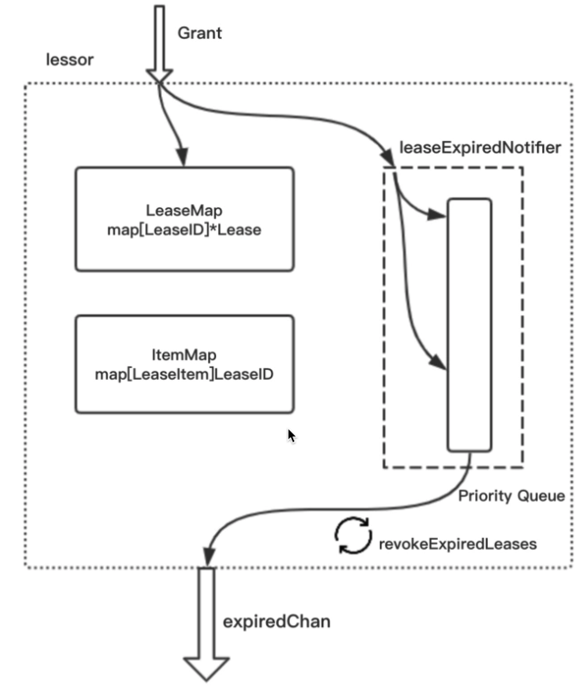

Leader 维护
* LeaseMap map[LeaseID]*Lease  --  用于根据LeaseID快速找到*Lease
* ItemMap map[LeaseItem]LeaseID -- 用于根据LeaseItem快速找到LeaseID，从而找到*Lease
* LeaseExpiredNotifier 是对 LeaseQueue 的一层封装， 快速找到即将过期的租约 (堆实现)


性能分析：
1. 不同 key 若 TTL 相同，可复用同一个 Lease， 显著减少了 Lease 数。
2. 通过 gRPC HTTP/2 实现了多路复用，流式传输，同一连接可支持为多个 Lease 续期，大大减少连接数。

### 3.6.3 实现
etcd Lessor 主循环每隔 500ms 执行一次撤销 Lease 检查（RevokeExpiredLease），若已过期则加入到待淘汰列表，直到堆顶的 Lease 过期时间大于当前，则结束本轮轮询。
```go
func (le *lessor) runLoop() {
	defer close(le.doneC)
    // 一直循环处理
	for {
        // 从优先队列头依次查找是否有过期，有的话放入通道
		le.revokeExpiredLeases()
		le.checkpointScheduledLeases()

        // 阻塞 500ms，进行下一步检测
		select {
		case <-time.After(500 * time.Millisecond):
		case <-le.stopC:
			return
		}
	}
}

func (le *lessor) revokeExpiredLeases() {
	var ls []*Lease

	// rate limit
	revokeLimit := leaseRevokeRate / 2

	le.mu.RLock()
	if le.isPrimary() {
		// 查找当前的过期租约
		ls = le.findExpiredLeases(revokeLimit)
	}
	le.mu.RUnlock()

	if len(ls) != 0 {
		select {
		case <-le.stopC:
			return
        // 过期租约写入通道
		case le.expiredC <- ls:
		default:
		    // 如果通道阻塞，则下次处理
		}
	}
}
```
### 3.6.4 revoke
1. 过期的lease 会发送到 expiredC
2. etcd server 收到过期lease，发送 lease revoke 请求, 通过 Raft Log 传递给 Follower 节点。
```go
func (s *EtcdServer) LeaseRevoke(ctx context.Context, r *pb.LeaseRevokeRequest) (*pb.LeaseRevokeResponse, error) {
	resp, err := s.raftRequestOnce(ctx, pb.InternalRaftRequest{LeaseRevoke: r})
	if err != nil {
		return nil, err
	}
	return resp.(*pb.LeaseRevokeResponse), nil
}
```
3. Follower 收到消息后获取 lease 关联的 key 列表
    * 从 boltdb 中删除 key
	* 从 Lessor 的 Lease map 内存中删除此 Lease 对象
	* boltdb 的 Lease bucket 中删除这个 Lease。

### 3.6.5 存储 
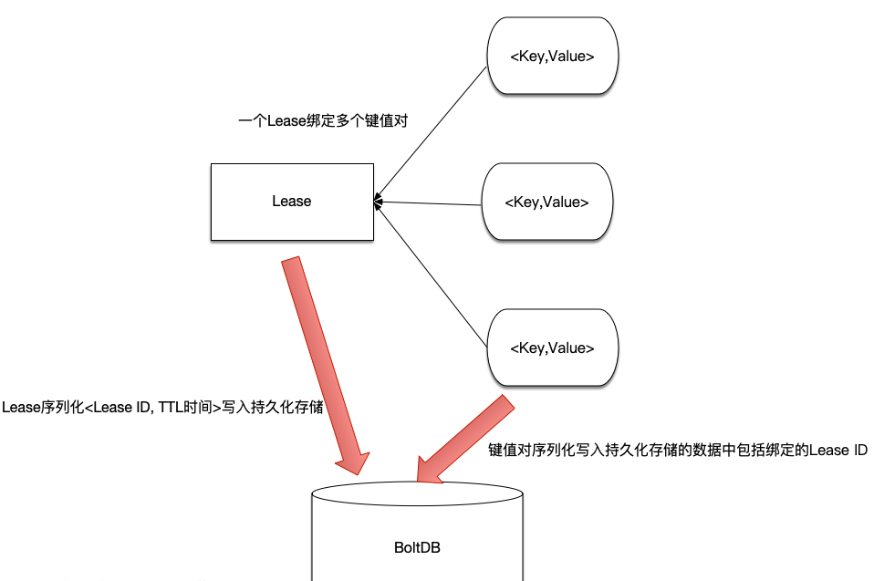

## 3.7 监听（watcher）
快速获取数据变更通知，而不是使用消耗可能大的轮询模式。

### 3.7.1 总体架构
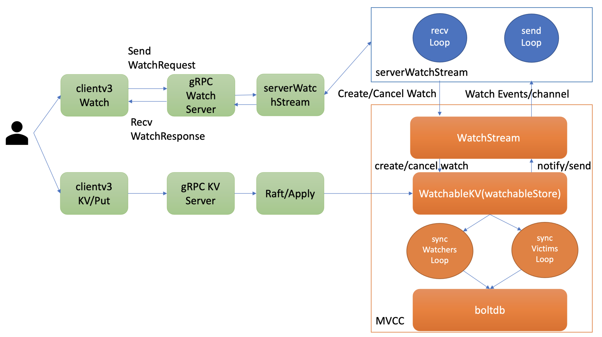

变更的消息是以Event的形式发送出去的，Event包括KeyValue，同时包括操作类型（Put、Delete等）
```go
type Event struct {
    // 更新或者删除
	Type Event_EventType `protobuf:"varint,1,opt,name=type,proto3,enum=mvccpb.EvGent_EventType" json:"type,omitempty"`
    //发生事件之后的数据
	Kv *KeyValue `protobuf:"bytes,2,opt,name=kv" json:"kv,omitempty"`
    // 发生事件之前的数据
	PrevKv *KeyValue `protobuf:"bytes,3,opt,name=prev_kv,json=prevKv" json:"prev_kv,omitempty"`
}
```

WatchResponse
```go
type WatchResponse struct {
	// WatchID is the WatchID of the watcher this response sent to.
	WatchID WatchID
    // 触发事件的集合
	Events []mvccpb.Event

    // response 创建时的 revision
	Revision int64
	// CompactRevision is set when the watcher is cancelled due to compaction.
	CompactRevision int64
}
```

### 3.7.2 连接复用
* http2  多路复用、数据帧乱序发送
* 一个 client/TCP 连接支持多 gRPC Stream， 一个 gRPC Stream 又支持多个 watcher
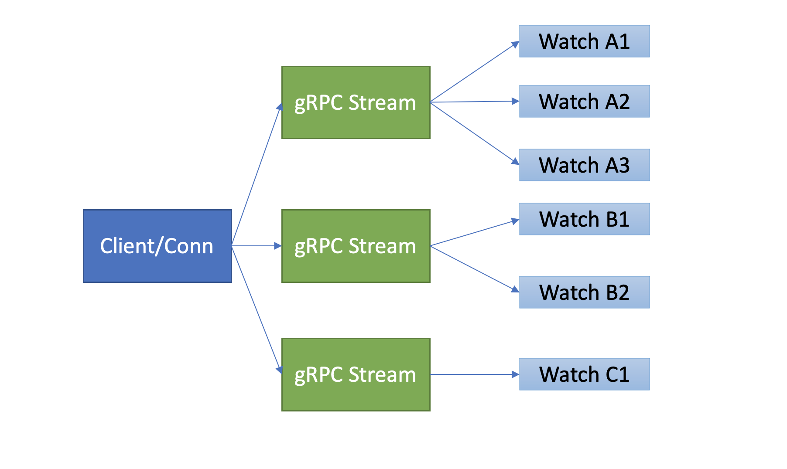


### 3.7.3 事件堆积的情况
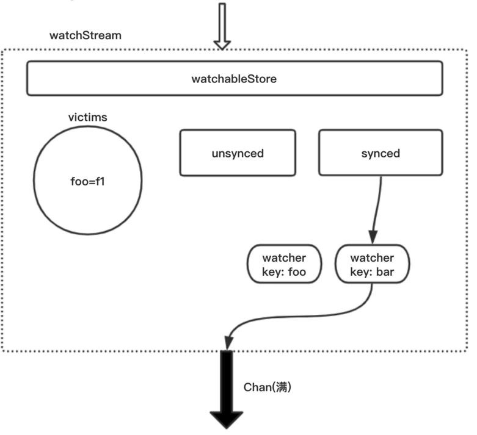

* synced watcher, 表示此类 watcher 监听的数据都已经同步完毕，在等待新的变更。
* unsynced watcher，表示此类 watcher 监听的数据还未同步完成，落后于当前最新数据变更，正在努力追赶。
* victims(受损)，如果 buffer（默认1024）慢了，会从synced 摘掉，放进 victims
    * 尝试将堆积的事件再次推送到 watcher 的接收 channel 中。
	    * 若推送失败，则再次加入到 victim watcherBatch 数据结构中等待下次重试。
		* 若推送成功，watcher 监听的最小版本号 (minRev) 小于等于 server 当前版本号 (currentRev)，加入到 unsynced watcherGroup, 否则重新进入 synced watcher

```go
func newWatchableStore(lg *zap.Logger, b backend.Backend, le lease.Lessor, as auth.AuthStore, ig ConsistentIndexGetter, cfg StoreConfig) *watchableStore {
	s := &watchableStore{
		store:    NewStore(lg, b, le, ig, cfg),
        victimc:  make(chan struct{}, 1),
        // 创建两个 watchergroup
		unsynced: newWatcherGroup(),
		synced:   newWatcherGroup(),
		stopc:    make(chan struct{}),
	}
	s.store.ReadView = &readView{s}
	s.store.WriteView = &writeView{s}
    s.wg.Add(2)
    // 触发两个协程，处理usync和victims的
	go s.syncWatchersLoop()
	go s.syncVictimsLoop()
	return s
}
```

### 3.7.4 怎么快速找到 key 对应的 watcher 实例
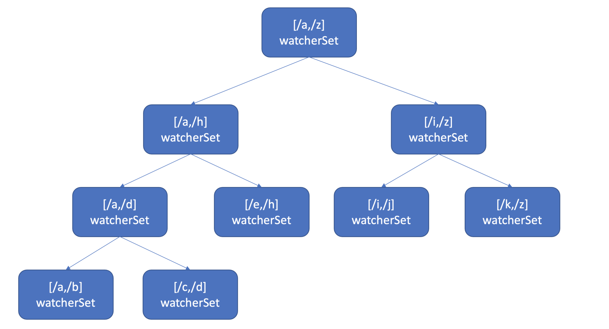

```go
type watcherGroup struct {
    // 只监听单个key的 watcher 实例, type watcherSetByKey map[string]watcherSet
	keyWatchers watcherSetByKey
    // ranges has the watchers that watch a range; it is sorted by interval
    // 区间树，记录进行范围监听的 watcher 实例
	ranges adt.IntervalTree
    // watchers is the set of all watchers
	watchers watcherSet
}
```
事件来临时：
1. 检查是否有 watcher 监听了单 key （keyWatchers）
2. 查找线段树，找到监听范围的所有 watchset
3. 对找到的所有 wathchset 进行通知


## 3.8 服务端（etcd server）
### 3.8.1 整体架构
**todo**

### 3.8.2 读写流程
#### 读

#### 写

## 3.8 客户端 （etcd client）
**todo**

## 3.9 维护（Maintenance）
**todo**

## 3.10 实际问题
todo 待大范围使用后补充

## 3.11 值得学习的设计
* raft层：分层解耦设计
* go http包: Transoport 维护的tcp连接池
* boltdb: 非常简单的存储设计
* watch 的设计： 考虑大量事件的缓冲
