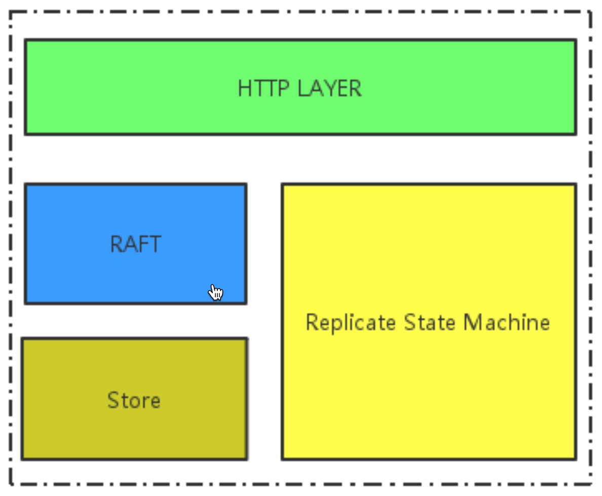
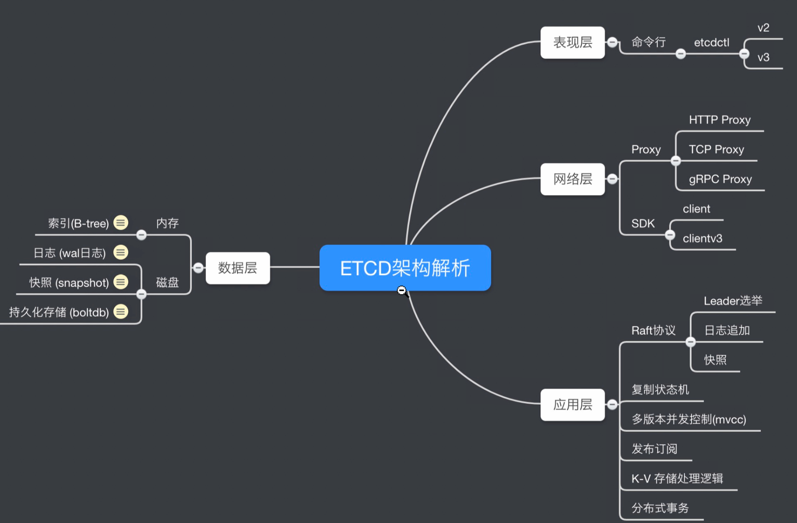
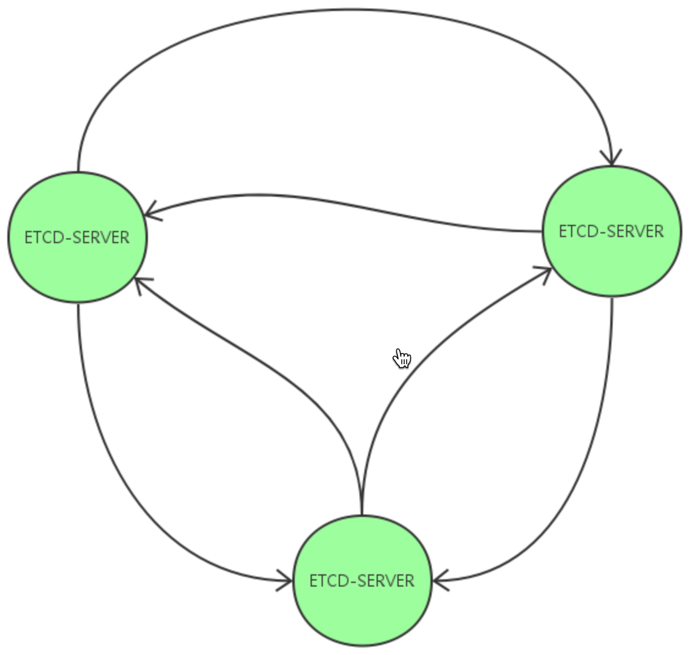

# 1. 简述
* API 接口： etcd v2 使用 http + json， etcd v3 使用 grpc
* 性能 https://github.com/etcd-io/etcd/blob/master/Documentation/op-guide/performance.md#benchmarks

# 2. 为什么使用 etcd
## etcd 是什么
* Highly-avaliable key value store for shared configuration and service discovery
    * kv 存储
    * 服务发现
* 写请求要 leader 处理，为了提高性能支持读请求从非leader节点

## 架构

* 网络层：提供网络数据读写功能，监听服务端口，完成集群节点之间数据通信，收发客户端数据；
* Raft模块：完整实现了Raft协议；
* 存储模块：KV存储，WAL文件，SNAPSHOT管理
* 复制状态机：这个是一个抽象的模块，状态机的数据维护在内存中，定期持久化到磁盘，每次写请求会持久化到WAL文件，并根据写请求的内容修改状态机数据。

## 拓扑

* 为了减少创建链接开销，ETCD节点在启动之初就创建了和集群其他节点之间的链接。因此，ETCD集群节点之间的网络拓扑是一个任意2个节点之间均有长链接相互连接的网状结构。
* 每一个节点都会创建到其他各个节点之间的长链接。每个节点会向其他节点宣告自己监听的端口，该端口只接受来自其他节点创建链接的请求。

## 通道
网络层必须能够高效地处理不同数据量的消息。ETCD在实现中，对这些消息采取了分类处理，抽象出了2种类型消息传输通道：Stream类型通道和Pipeline类型通道。
* Stream类型通道：点到点之间维护HTTP长链接，主要用于传输数据量较小的消息，例如追加日志，心跳等；
* Pipeline类型通道：点到点之间不维护HTTP长链接，短链接传输数据，用完即关闭。用于传输数据量大的消息，例如snapshot数据。

# 3. 体验 etcd 
## API V2 和 V3
https://etcd.io/docs/v3.4.0/demo/

## 主要应用场景
* 服务发现（Service Discovery）
* 消息发布与订阅
* 负载均衡
* 分布式通知与协调
* 分布式锁、分布式队列
* 集群监控与Leader竞选

# 4. etcd 运维和安全
todo