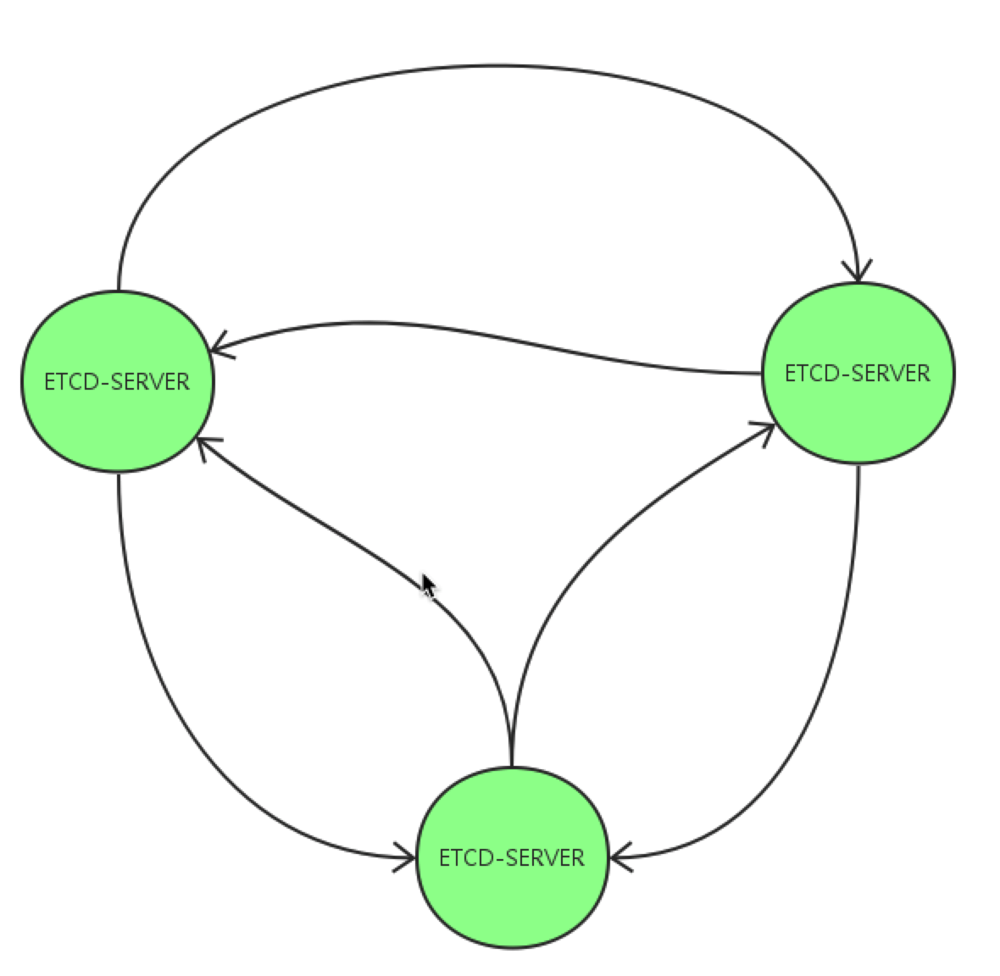

## etcd 集群之间网络传输的主要场景
* leader 向 follower 传递心跳包，follower 向 leader回复消息
* leader 向 follower 发送追加日志
* leader 向 follower 发送 snapshot 数据
* candidate 发起选举
* follower 收到写操作转发给 leader

## etcd 网络拓扑

每一个节点都会创建到其他各个节点之间的长链接。每个节点会向其他节点宣告自己监听的端口，该端口只接受来自其他节点创建链接的请求。

## etcd 数据通道
在ETCD实现中，根据不同用途，定义了各种不同的消息类型。各种不同的消息，最终都通过google protocol buffer协议进行封装。这些消息携带的数据大小可能不尽相同。例如 传输SNAPSHOT数据的消息数据量就比较大，甚至超过1GB, 而leader到follower节点之间的心跳消息可能只有几十个字节。

ETCD在实现中，对这些消息采取了分类处理，抽象出了2种类型消息传输通道：Stream类型通道和Pipeline类型通道。这两种消息传输通道都使用HTTP协议传输数据。

集群启动之初，就创建了这两种传输通道，各自特点：
* Stream类型通道：点到点之间维护HTTP长链接，主要用于传输数据量较小的消息，例如追加日志，心跳等；
* Pipeline类型通道：点到点之间不维护HTTP长链接，短链接传输数据，用完即关闭。用于传输数据量大的消息，例如snapshot数据。

### Stream类型通道
Stream类型通道处理数据量少的消息，例如心跳，日志追加消息。点到点之间只维护1个HTTP长链接，交替向链接中写入数据，读取数据。

Stream 类型通道是节点启动后主动与其他每一个节点建立。Stream类型通道通过 Channel 与Raft模块传递消息。每一个Stream类型通道关联2个Goroutines, 其中一个用于建立HTTP链接，并从链接上读取数据, decode成message, 通过Channel传给Raft模块中，另外一个通过Channel 从Raft模块中收取消息，然后写入通道。

ETCD使用golang的http包实现Stream类型通道：
* 被动发起方监听端口, 并在对应的url上挂载相应的handler（当前请求来领时，handler的ServeHTTP方法会被调用）
* 主动发起方发送HTTP GET请求；
* 监听方的Handler的ServeHTTP访问被调用(框架层传入http.ResponseWriter和http.Request对象），其中http.ResponseWriter对象作为参数传入Writter-Goroutine（就这么称呼吧），该Goroutine的主循环就是将Raft模块传出的message写入到这个responseWriter对象里；http.Request的成员变量Body传入到Reader-Gorouting(就这么称呼吧），该Gorutine的主循环就是不断读取Body上的数据，decode成message 通过Channel传给Raft模块。

### Pipeline类型通道
Pipeline类型通道处理数量大消息，例如SNAPSHOT消息。这种类型消息需要和心跳等消息分开处理，否则会阻塞心跳。

Pipeline类型通道也可以传输小数据量的消息，当且仅当Stream类型链接不可用时。

Pipeline类型通道可用并行发出多个消息，维护一组Goroutines, 每一个Goroutines都可向对端发出POST请求（携带数据），收到回复后，链接关闭。

ETCD使用golang的http包实现的：
* 根据参数配置，启动N个Goroutines；
* 每一个Goroutines的主循环阻塞在消息Channel上，当收到消息后，通过POST请求发出数据，并等待回复。