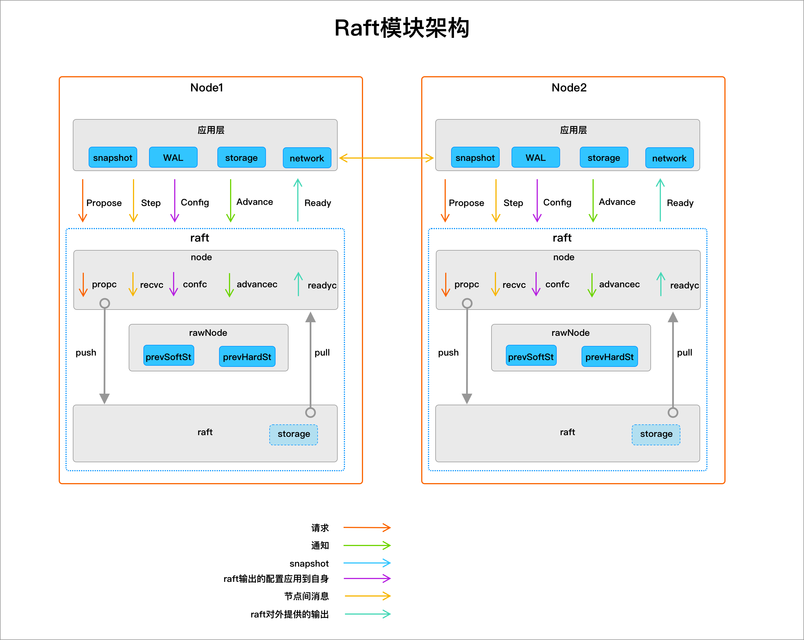

# 0 说明
etcd-raft 有两大结构体， raft 和 node

## node
node结构体实现了Node接口，负责跟应用层对接

## raft
raft结构体是raft算法的主要实现。

* node把输入推给raft，raft根据输入和当前的状态数据生成输出，输出临时保存在raft内，node会检查raft是否有输出，如果有输出数据，就把输出生成Ready结构体，并传递给应用层。

* raft应用层有一个storage，存放的是当前的状态数据，包含了保存在内存中的log entry，但这个storage并不是raft的，是应用层的，raft只从中读取数据，log entry 的写入由应用层负责。

# 1 总体架构

# 2 重要概念
* WAL是Write Ahead Logs的缩写，存储的是log entry记录，即所有写请求的记录。

* storage也是存的log entry，只不过是保存在内存中的。

* kv db是保存了所有数据的最新值，而log entry是修改数据值的操作记录。

* log entry在集群节点之间达成共识之后，log entry会写入WAL文件，也会写入storage，然后会被应用到kv store中，改变kv db中的数据。

* Snapshot是kv db是某个log entry被应用后生成的快照，可以根据快照快速回复kv db，而无需从所有的历史log entry依次应用，恢复kv db。
