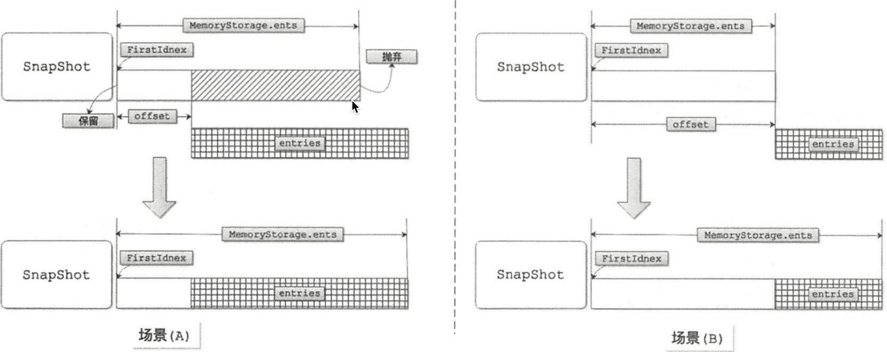
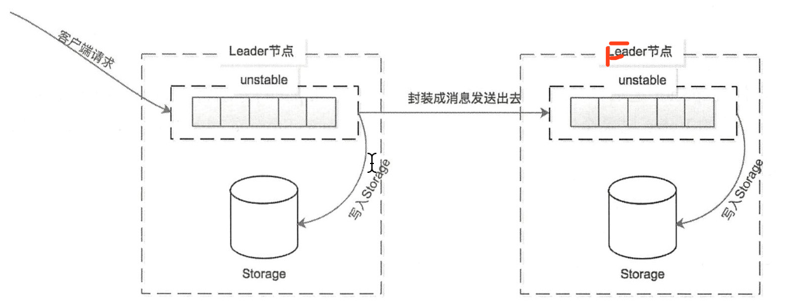
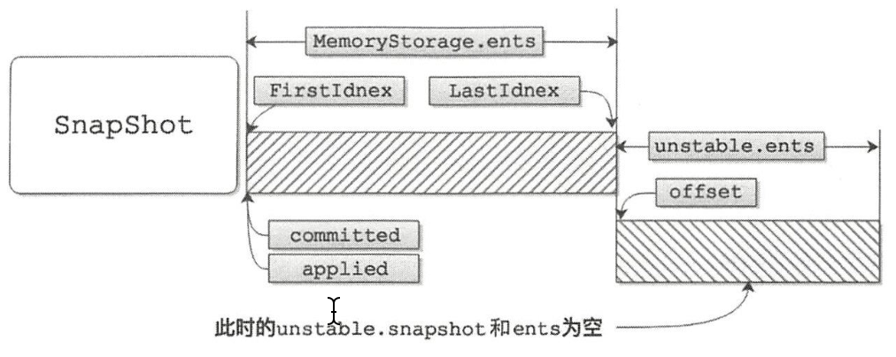

# raft 相关结构体
## raft struct
核心结构体，封装了当前节点所有核心数据，定义如下：

raft/raft.go:254
```go
type raft struct {
	id uint64

    Term uint64
    // 该任期该节点投票给的节点
	Vote uint64

	readStates []ReadState

    // the log
    // raft 节点记录的本地 log，会涉及到日志的缓存
	raftLog *raftLog

    // 单挑消息最大字节数
	maxMsgSize         uint64
	maxUncommittedSize uint64
    // TODO(tbg): rename to trk.
    // leader 额外维护 follower 索引记录已发送 diff
    //    nextIndex []，记录每一个follower下一条日志的索引值
    //    matchIndex []，已经复制给每个follower的最大日志索引值
	prs tracker.ProgressTracker

    // 节点的角色
	state StateType

	// isLearner is true if the local raft node is a learner.
	isLearner bool

    // 缓存当前节点等待发送的消息
	msgs []pb.Message

	// the leader id
	lead uint64
	// leadTransferee is id of the leader transfer target when its value is not zero.
	// Follow the procedure defined in raft thesis 3.10.
	leadTransferee uint64
	// Only one conf change may be pending (in the log, but not yet
	// applied) at a time. This is enforced via pendingConfIndex, which
	// is set to a value >= the log index of the latest pending
	// configuration change (if any). Config changes are only allowed to
	// be proposed if the leader's applied index is greater than this
	// value.
	pendingConfIndex uint64
	// an estimate of the size of the uncommitted tail of the Raft log. Used to
	// prevent unbounded log growth. Only maintained by the leader. Reset on
	// term changes.
	uncommittedSize uint64

	readOnly *readOnly

	// number of ticks since it reached last electionTimeout when it is leader
	// or candidate.
	// number of ticks since it reached last electionTimeout or received a
    // valid message from current leader when it is a follower.
    // 选举计时器
	electionElapsed int

	// number of ticks since it reached last heartbeatTimeout.
    // only leader keeps heartbeatElapsed.
    // 心跳计时器
	heartbeatElapsed int

	checkQuorum bool
	preVote     bool

	heartbeatTimeout int
	electionTimeout  int
	// randomizedElectionTimeout is a random number between
	// [electiontimeout, 2 * electiontimeout - 1]. It gets reset
	// when raft changes its state to follower or candidate.
	randomizedElectionTimeout int
	disableProposalForwarding bool

	tick func()
	step stepFunc

	logger Logger
}
```
## config struct
用于配置参数的传递，创建 raft 实例的时候需要传递

raft/raft.go:116
```go
// Config contains the parameters to start a raft.
type Config struct {
	// ID is the identity of the local raft. ID cannot be 0.
	ID uint64

	// peers contains the IDs of all nodes (including self) in the raft cluster. It
	// should only be set when starting a new raft cluster. Restarting raft from
	// previous configuration will panic if peers is set. peer is private and only
	// used for testing right now.
	peers []uint64

	// learners contains the IDs of all learner nodes (including self if the
	// local node is a learner) in the raft cluster. learners only receives
	// entries from the leader node. It does not vote or promote itself.
	learners []uint64

	// ElectionTick is the number of Node.Tick invocations that must pass between
	// elections. That is, if a follower does not receive any message from the
	// leader of current term before ElectionTick has elapsed, it will become
	// candidate and start an election. ElectionTick must be greater than
	// HeartbeatTick. We suggest ElectionTick = 10 * HeartbeatTick to avoid
	// unnecessary leader switching.
	ElectionTick int
	// HeartbeatTick is the number of Node.Tick invocations that must pass between
	// heartbeats. That is, a leader sends heartbeat messages to maintain its
	// leadership every HeartbeatTick ticks.
	HeartbeatTick int

	// Storage is the storage for raft. raft generates entries and states to be
	// stored in storage. raft reads the persisted entries and states out of
	// Storage when it needs. raft reads out the previous state and configuration
	// out of storage when restarting.
	Storage Storage
	// Applied is the last applied index. It should only be set when restarting
	// raft. raft will not return entries to the application smaller or equal to
	// Applied. If Applied is unset when restarting, raft might return previous
	// applied entries. This is a very application dependent configuration.
	Applied uint64

	// MaxSizePerMsg limits the max byte size of each append message. Smaller
	// value lowers the raft recovery cost(initial probing and message lost
	// during normal operation). On the other side, it might affect the
	// throughput during normal replication. Note: math.MaxUint64 for unlimited,
	// 0 for at most one entry per message.
	MaxSizePerMsg uint64
	// MaxCommittedSizePerReady limits the size of the committed entries which
	// can be applied.
	MaxCommittedSizePerReady uint64
	// MaxUncommittedEntriesSize limits the aggregate byte size of the
	// uncommitted entries that may be appended to a leader's log. Once this
	// limit is exceeded, proposals will begin to return ErrProposalDropped
	// errors. Note: 0 for no limit.
	MaxUncommittedEntriesSize uint64
	// MaxInflightMsgs limits the max number of in-flight append messages during
	// optimistic replication phase. The application transportation layer usually
	// has its own sending buffer over TCP/UDP. Setting MaxInflightMsgs to avoid
	// overflowing that sending buffer. TODO (xiangli): feedback to application to
	// limit the proposal rate?
	MaxInflightMsgs int

	// CheckQuorum specifies if the leader should check quorum activity. Leader
	// steps down when quorum is not active for an electionTimeout.
	CheckQuorum bool

	// PreVote enables the Pre-Vote algorithm described in raft thesis section
	// 9.6. This prevents disruption when a node that has been partitioned away
	// rejoins the cluster.
	PreVote bool

	// ReadOnlyOption specifies how the read only request is processed.
	//
	// ReadOnlySafe guarantees the linearizability of the read only request by
	// communicating with the quorum. It is the default and suggested option.
	//
	// ReadOnlyLeaseBased ensures linearizability of the read only request by
	// relying on the leader lease. It can be affected by clock drift.
	// If the clock drift is unbounded, leader might keep the lease longer than it
	// should (clock can move backward/pause without any bound). ReadIndex is not safe
	// in that case.
	// CheckQuorum MUST be enabled if ReadOnlyOption is ReadOnlyLeaseBased.
	ReadOnlyOption ReadOnlyOption

	// Logger is the logger used for raft log. For multinode which can host
	// multiple raft group, each raft group can have its own logger
	Logger Logger

	// DisableProposalForwarding set to true means that followers will drop
	// proposals, rather than forwarding them to the leader. One use case for
	// this feature would be in a situation where the Raft leader is used to
	// compute the data of a proposal, for example, adding a timestamp from a
	// hybrid logical clock to data in a monotonically increasing way. Forwarding
	// should be disabled to prevent a follower with an inaccurate hybrid
	// logical clock from assigning the timestamp and then forwarding the data
	// to the leader.
	DisableProposalForwarding bool
}
```

## storage struct
主要作用是存储当前节点接受的 Entry

raft/storage.go:46
```go
// Storage is an interface that may be implemented by the application
// to retrieve log entries from storage.
//
// If any Storage method returns an error, the raft instance will
// become inoperable and refuse to participate in elections; the
// application is responsible for cleanup and recovery in this case.
type Storage interface {
	// TODO(tbg): split this into two interfaces, LogStorage and StateStorage.

	// InitialState returns the saved HardState and ConfState information.
	InitialState() (pb.HardState, pb.ConfState, error)
	// Entries returns a slice of log entries in the range [lo,hi).
	// MaxSize limits the total size of the log entries returned, but
	// Entries returns at least one entry if any.
	Entries(lo, hi, maxSize uint64) ([]pb.Entry, error)
	// Term returns the term of entry i, which must be in the range
	// [FirstIndex()-1, LastIndex()]. The term of the entry before
	// FirstIndex is retained for matching purposes even though the
	// rest of that entry may not be available.
	Term(i uint64) (uint64, error)
	// LastIndex returns the index of the last entry in the log.
	LastIndex() (uint64, error)
	// FirstIndex returns the index of the first log entry that is
	// possibly available via Entries (older entries have been incorporated
	// into the latest Snapshot; if storage only contains the dummy entry the
	// first log entry is not available).
	FirstIndex() (uint64, error)
	// Snapshot returns the most recent snapshot.
	// If snapshot is temporarily unavailable, it should return ErrSnapshotTemporarilyUnavailable,
	// so raft state machine could know that Storage needs some time to prepare
	// snapshot and call Snapshot later.
	Snapshot() (pb.Snapshot, error)
}
```

### MemoryStorage struct
```go
// MemoryStorage implements the Storage interface backed by an
// in-memory array.
type MemoryStorage struct {
	// Protects access to all fields. Most methods of MemoryStorage are
	// run on the raft goroutine, but Append() is run on an application
	// goroutine.
	sync.Mutex

	hardState pb.HardState
	snapshot  pb.Snapshot
    // ents[i] has raft log position i+snapshot.Metadata.Index
    // 维护快照之后的所有entry记录
	ents []pb.Entry
}
```
示意图：


#### 更新快照接口
比如节点重启后，需要读取快照文件更新
```go
// ApplySnapshot overwrites the contents of this Storage object with
// those of the given snapshot.
func (ms *MemoryStorage) ApplySnapshot(snap pb.Snapshot) error {
	ms.Lock()
	defer ms.Unlock()

	//handle check for old snapshot being applied
	msIndex := ms.snapshot.Metadata.Index
	snapIndex := snap.Metadata.Index
	if msIndex >= snapIndex {
		return ErrSnapOutOfDate
	}

	ms.snapshot = snap
	ms.ents = []pb.Entry{{Term: snap.Metadata.Term, Index: snap.Metadata.Index}}
	return nil
}
```
#### 添加新的 entry 接口
```go
// Append the new entries to storage.
// TODO (xiangli): ensure the entries are continuous and
// entries[0].Index > ms.entries[0].Index
func (ms *MemoryStorage) Append(entries []pb.Entry) error {
	if len(entries) == 0 {
		return nil
	}

	ms.Lock()
	defer ms.Unlock()

	first := ms.firstIndex()
	last := entries[0].Index + uint64(len(entries)) - 1

	// shortcut if there is no new entry.
	if last < first {
		return nil
	}
	// truncate compacted entries
	if first > entries[0].Index {
		entries = entries[first-entries[0].Index:]
	}

	offset := entries[0].Index - ms.ents[0].Index
	switch {
	case uint64(len(ms.ents)) > offset:
		ms.ents = append([]pb.Entry{}, ms.ents[:offset]...)
		ms.ents = append(ms.ents, entries...)
	case uint64(len(ms.ents)) == offset:
		ms.ents = append(ms.ents, entries...)
	default:
		raftLogger.Panicf("missing log entry [last: %d, append at: %d]",
			ms.lastIndex(), entries[0].Index)
	}
	return nil
}
```
添加的场景图


## unstable struct 
刚刚接收到的 entry 都先进入到 unstable 里


## raftLog  struct
raft/log.go:24
```go
type raftLog struct {
    // storage contains all stable entries since the last snapshot.
    // 就是前边的 MemoryStorage
	storage Storage

	// unstable contains all unstable entries and snapshot.
	// they will be saved into storage.
	unstable unstable

	// committed is the highest log position that is known to be in
	// stable storage on a quorum of nodes.
	committed uint64
	// applied is the highest log position that the application has
	// been instructed to apply to its state machine.
	// Invariant: applied <= committed
	applied uint64

	logger Logger

	// maxNextEntsSize is the maximum number aggregate byte size of the messages
	// returned from calls to nextEnts.
	maxNextEntsSize uint64
}
```
### new 接口
```go
// newLog returns log using the given storage and default options. It
// recovers the log to the state that it just commits and applies the
// latest snapshot.
func newLog(storage Storage, logger Logger) *raftLog {
	return newLogWithSize(storage, logger, noLimit)
}

// newLogWithSize returns a log using the given storage and max
// message size.
func newLogWithSize(storage Storage, logger Logger, maxNextEntsSize uint64) *raftLog {
	if storage == nil {
		log.Panic("storage must not be nil")
	}
	log := &raftLog{
		storage:         storage,
		logger:          logger,
		maxNextEntsSize: maxNextEntsSize,
	}
	firstIndex, err := storage.FirstIndex()
	if err != nil {
		panic(err) // TODO(bdarnell)
	}
	lastIndex, err := storage.LastIndex()
	if err != nil {
		panic(err) // TODO(bdarnell)
	}
	log.unstable.offset = lastIndex + 1
	log.unstable.logger = logger
	// Initialize our committed and applied pointers to the time of the last compaction.
	log.committed = firstIndex - 1
	log.applied = firstIndex - 1

	return log
}
```
